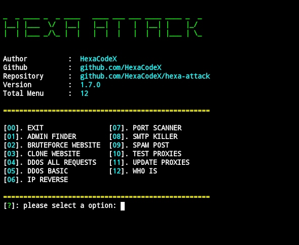

# Hexa Attack
is an open source tool for performing DDOS simulations and also provides some additional features that are useful for penetration testingis an open source tool for performing DDOS simulations and also provides some additional features that are useful for penetration testing.
## installation

```shell
git clone https://github.com/HexaCodeX/hexa-attack
cd hexa-attack
pip install -r requirements.txt
```

## configuration
you can change the basic configuration at `~/config.json` file

```json
{
  "name": "hexa-attack",
  "author": "HexaCodeX",
  "version": "1.7.0",
  "workers": 50,
  "environment": "production",
  "useProxy": true
}
```

## how to usage

### run the program

```shell
python main.py
```

## preview



> built with ♥️ by HexaCodeX
